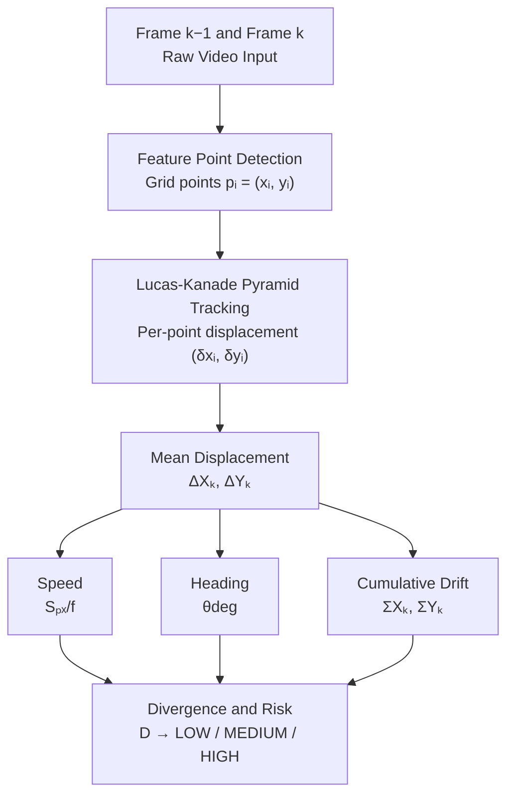

# Monocular Optical Flow Telemetry Architecture

Mathematical workflow describing how raw camera video is converted into flight telemetry for the Walle FPV platform.

**Notation key**

| Symbol | Meaning |
|---|---|
| i | index of a tracked feature point (i = 1 … N) |
| k | index of the current frame; k−1 = previous frame |
| t | index of a frame in the drift-integration history |
| N | number of inlier (successfully tracked) points |
| M | total number of candidate grid points |
| xᵢ , yᵢ | pixel coordinates of point i |
| ΔXₖ , ΔYₖ | mean frame-level displacement at frame k |

---

## 1. Pipeline Overview



**Stage summary**

| Stage | Process | Output |
|---|---|---|
| 1 | Capture consecutive frames | Frame k−1, Frame k |
| 2 | Detect feature points on a grid | Points pᵢ = (xᵢ, yᵢ) |
| 3 | Lucas-Kanade pyramid tracking | Per-point displacement (δxᵢ, δyᵢ) |
| 4 | Average displacement across points | Mean ΔXₖ, ΔYₖ |
| 5 | Derive motion metrics | Speed, Heading, Cumulative Drift |
| 6 | Compute radial divergence | Obstacle risk level |

> ΔXₖ and ΔYₖ are the root values. Every downstream metric (Speed, Heading, Drift, Divergence) is derived directly from this pair.

---

## 2. Stage-by-Stage Derivations

### Stage 1 – Frame Rate

```
FPS = 1 / (tₖ − tₖ₋₁)
```

Time delta between the current frame k and the previous frame k−1.

### Stage 2 – Tracked Vector Count

```
N = Σ (i=1 to M)  𝟙[ pᵢ is an inlier ]
```

- **M** — total candidate grid points
- **𝟙[·]** — indicator function (1 if the point passes the LK confidence check, 0 otherwise)
- **N** sets the statistical reliability of every downstream metric

### Stage 3 – Per-Point Displacement

For each tracked point pᵢ = (xᵢ, yᵢ), between frame k−1 and frame k:

```
δxᵢ = xᵢ,ₖ − xᵢ,ₖ₋₁
δyᵢ = yᵢ,ₖ − yᵢ,ₖ₋₁
```

- **xᵢ,ₖ** — x-coordinate of point i at frame k
- **xᵢ,ₖ₋₁** — x-coordinate of the same point i at frame k−1
(same convention for y)

### Stage 4 – Mean Displacement (ΔXₖ, ΔYₖ)

Average the per-point displacements over all N inlier points:

```
        1   N
ΔXₖ =  ─── Σ  δxᵢ
        N  i=1

        1   N
ΔYₖ =  ─── Σ  δyᵢ
        N  i=1
```

### Stage 5A – Speed

**Pixel-space speed magnitude:**

```
Sₚₓ/f = √( (ΔXₖ)² + (ΔYₖ)² )
```

**Conversion to real-world speed** — Z = altitude above ground, f = camera focal length:

```
Sₘ/ₛ = Sₚₓ/f × FPS × (Z / f)
```

### Stage 5B – Heading

```
θdeg = atan2(ΔYₖ, ΔXₖ) × (180 / π)
```

| θdeg | Direction |
|---|---|
| 0° | Right |
| +90° | Down |
| ±180° | Left |
| −90° | Up |

### Stage 5C – Cumulative Drift

Discrete integration of displacement from takeoff (k = 0) to the current frame k:

```
                          k
ΣXₖ = ΣXₖ₋₁ + ΔXₖ  =  Σ  ΔXₜ
                         t=1

                          k
ΣYₖ = ΣYₖ₋₁ + ΔYₖ  =  Σ  ΔYₜ
                         t=1
```

Sent to the flight controller for indoor position hold and automatic drift compensation.

### Stage 6 – Divergence and Obstacle Risk

Let **c** = (W/2, H/2) be the image center.
For point i: **rᵢ** = pᵢ − c (radial vector from center to point), **vᵢ** = (δxᵢ, δyᵢ) (its displacement vector).

**Radial divergence** — mean outward expansion rate of flow vectors:

```
        1   N    rᵢ · vᵢ
D  =   ─── Σ    ─────────
        N  i=1    ‖rᵢ‖
```

**Obstacle risk classification:**

```
              ⎧ HIGH,    D > 2.50
Obstacle_Risk = ⎨ MEDIUM,  1.20 < D ≤ 2.50
              ⎩ LOW,     D ≤ 1.20
```

---

## 3. Master Parameter Table

| Parameter | Symbol | Depends On | Formula | Engineering Use |
|---|---|---|---|---|
| `FPS` | — | Frame timestamps | 1 / (tₖ − tₖ₋₁) | Loop stability check (≥ 30 Hz) |
| `Tracked_Vectors` | N | LK inlier mask | Σᵢ₌₁ᴹ 𝟙[inlierᵢ] | Measurement confidence index |
| `Displacement_dX` | ΔXₖ | Point coordinates | (1/N) Σᵢ₌₁ᴺ (xᵢ,ₖ − xᵢ,ₖ₋₁) | Horizontal velocity component |
| `Displacement_dY` | ΔYₖ | Point coordinates | (1/N) Σᵢ₌₁ᴺ (yᵢ,ₖ − yᵢ,ₖ₋₁) | Vertical velocity component |
| `Speed_px_f` | Sₚₓ/f | ΔXₖ, ΔYₖ | √(ΔXₖ² + ΔYₖ²) | Total 2D movement speed |
| `Heading_deg` | θdeg | ΔXₖ, ΔYₖ | atan2(ΔYₖ, ΔXₖ) × 180/π | Motion compass HUD needle angle |
| `Cumulative_Drift_X` | ΣXₖ | Past ΔX history | Σₜ₌₁ᵏ ΔXₜ | Position lock / return-to-home |
| `Cumulative_Drift_Y` | ΣYₖ | Past ΔY history | Σₜ₌₁ᵏ ΔYₜ | Position lock / return-to-home |
| `Divergence` | D | Vectors + image center | (1/N) Σᵢ₌₁ᴺ (rᵢ·vᵢ)/‖rᵢ‖ | Approaching-obstacle expansion rate |
| `Obstacle_Risk` | — | D | Piecewise threshold on D | Automatic emergency braking trigger |

---

## References

- Part of the **Walle FPV** autonomous quadcopter platform documentation.
- Related module: Sparse Lucas-Kanade / Dense Farneback Optical Flow implementations.
