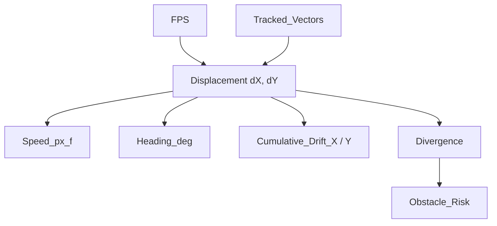

# Optical Flow Telemetry — Quick Reference

Ten values, one idea: **everything comes from comparing two consecutive video frames.**

---

## The Big Picture

```
FPS + Tracked_Vectors  →  Displacement (dX, dY)  →  everything else
```

- **FPS** and **Tracked_Vectors** are the setup — timing and sample size.
- **Displacement_dX_px / dY_px** is the one real measurement per frame.
- **Speed, Heading, Drift, Divergence, Risk** are all just different ways of reading that one measurement.



---

## 1. FPS — how fast we're sampling

**What it is:** frames processed per second.

**Formula:**
```
FPS = 1 / (tₖ − tₖ₋₁)
```

**Breaking it down:**

| Term | Meaning |
|---|---|
| `tₖ` | timestamp of the current frame |
| `tₖ₋₁` | timestamp of the previous frame |
| `tₖ − tₖ₋₁` | time gap between the two frames (seconds) |
| `1 / (gap)` | flips a time gap into a rate — frames per second |

**Plain English:** if two frames are 33 milliseconds apart, FPS ≈ 30. It's just a stopwatch reading — nothing is derived to get this.

---

## 2. Tracked_Vectors (N) — how many points we trust

**What it is:** the number of feature points the tracker successfully followed from one frame to the next.

**Formula:**
```
N = count of points where confidence(point) passes threshold
```

**Breaking it down:**

| Term | Meaning |
|---|---|
| `points` | the ~100 grid points the tracker starts with each frame |
| `confidence(point)` | LK's own score for how sure it is that point was tracked correctly |
| `threshold` | the cutoff confidence score must clear to be trusted |
| `N` | how many points survive that cutoff |

**Plain English:** out of ~100 dots placed on the ground image, maybe 85 survive tracking. N = 85. Every average calculated later divides by this N — more points, more reliable the numbers below are.

---

## 3. Displacement_dX_px / Displacement_dY_px — the core measurement

**What it is:** how far, on average, the tracked points moved sideways (dX) and up/down (dY) between two frames, in pixels.

**Formula:**
```
dX = (1/N) × Σ (xᵢ,ₖ − xᵢ,ₖ₋₁)
dY = (1/N) × Σ (yᵢ,ₖ − yᵢ,ₖ₋₁)
```

**Breaking it down:**

| Term | Meaning |
|---|---|
| `xᵢ,ₖ` | x-position of tracked point i, in the current frame k |
| `xᵢ,ₖ₋₁` | x-position of that same point i, in the previous frame |
| `xᵢ,ₖ − xᵢ,ₖ₋₁` | how far point i moved sideways, in pixels |
| `Σ (...)` | add that up across all N tracked points |
| `(1/N) × Σ (...)` | turn the total into an average per point |
| *(same pattern with y for `dY`)* | vertical movement instead of horizontal |

**Plain English:** this is the root value. Every other metric below is just this pair of numbers, viewed differently.

---

## 4. Speed_px_f — how fast, as one number

**What it is:** the straight-line speed of the movement, combining dX and dY.

**Formula:**
```
Speed_px_f = √(dX² + dY²)
Speed_m/s  = Speed_px_f × FPS × (Z / f)
```

**Breaking it down:**

| Term | Meaning |
|---|---|
| `dX² + dY²` | squares of sideways and vertical movement (Pythagoras setup) |
| `√(...)` | combines both directions into one straight-line distance, in pixels per frame |
| `× FPS` | converts "pixels per frame" into "pixels per second" |
| `Z` | drone's altitude above ground |
| `f` | camera focal length |
| `× (Z / f)` | scales pixel-per-second speed into real meters per second |

**Plain English:** dX and dY are like "moved right" and "moved down" separately. Speed is the diagonal distance — same idea as Pythagoras' theorem for a right triangle.

---

## 5. Heading_deg — which direction

**What it is:** the compass-style direction the drone is drifting, in degrees.

**Formula:**
```
Heading_deg = atan2(dY, dX) × (180 / π)
```

**Breaking it down:**

| Term | Meaning |
|---|---|
| `dY` | vertical displacement (from Step 3) |
| `dX` | horizontal displacement (from Step 3) |
| `atan2(dY, dX)` | angle of the (dX, dY) vector, in **radians** |
| `× (180 / π)` | converts that angle from radians to **degrees** |

**Reading the result:**

| Heading_deg | Direction |
|---|---|
| 0° | Right |
| 90° | Down |
| 180° / −180° | Left |
| −90° | Up |

**Plain English:** Speed tells you *how far* the arrow points; Heading tells you *which way* it points. Same (dX, dY) pair, read as an angle instead of a length — `atan2` is just the standard function for turning a horizontal/vertical pair into an angle, and the `180/π` term is only there to convert the answer into degrees people can read.

---

## 6. Cumulative_Drift_X_px / Y_px — total distance traveled

**What it is:** the running total of dX and dY, added up since the drone took off.

**Formula:**
```
ΣXₖ = ΣXₖ₋₁ + dXₖ
ΣYₖ = ΣYₖ₋₁ + dYₖ
```

**Breaking it down:**

| Term | Meaning |
|---|---|
| `ΣXₖ₋₁` | total drift built up through the previous frame |
| `dXₖ` | the new displacement measured this frame (from Step 3) |
| `ΣXₖ` | running total after adding this frame's movement |
| *(same pattern with Y)* | vertical drift instead of horizontal |

**Plain English:** dX/dY tell you the speed *right now*. Drift keeps a running tally, so you always know how far off the starting point the drone has wandered. This is what lets the drone "remember" where home is without GPS.

---

## 7. Divergence — is something getting closer?

**What it is:** a measure of whether the tracked points are spreading *outward* from the center of the camera image.

**Formula:**
```
D = (1/N) × Σ ( (rᵢ · vᵢ) / ‖rᵢ‖ )
```

**Breaking it down:**

| Term | Meaning |
|---|---|
| `rᵢ` | vector from the image center to tracked point i |
| `vᵢ` | that point's own movement vector (δxᵢ, δyᵢ) this frame |
| `rᵢ · vᵢ` | how much of the point's motion is pointing *away from* center (dot product) |
| `‖rᵢ‖` | distance of point i from the image center |
| `(rᵢ · vᵢ) / ‖rᵢ‖` | outward motion, normalized so far and near points are compared fairly |
| `(1/N) × Σ (...)` | average that outward score across all N tracked points |

**Plain English:** when a drone flies toward a wall, everything in the camera view appears to expand outward from the center — like zooming in. Divergence measures that expansion. It uses the same per-point movements as step 3, just checked against direction-from-center instead of averaged directly.

---

## 8. Obstacle_Risk — the simple traffic light

**What it is:** Divergence converted into one of three labels.

**Formula:**
```
Divergence > 2.50        →  HIGH
1.20 < Divergence ≤ 2.50 →  MEDIUM
Divergence ≤ 1.20        →  LOW
```

**Plain English:** no new calculation — just sorting the Divergence number into a bucket a pilot or autopilot can react to instantly.

---

## The One-Sentence Summary

**FPS** and **Tracked_Vectors** set up a trustworthy measurement → **Displacement (dX, dY)** is that one real measurement → **Speed** (how far), **Heading** (which way), and **Drift** (total distance so far) are three plain readings of that same measurement → **Divergence** re-checks the same per-point motions for outward expansion → **Obstacle_Risk** turns that into a simple LOW/MEDIUM/HIGH warning.

---

## Parameter Summary & Formulas

| Parameter Name | Symbol | Standard Formula | Units | Physical / Engineering Meaning |
| :--- | :--- | :--- | :--- | :--- |
| **Frames Per Second** | **FPS** | `FPS = 1 / Δt` | Hz (fps) | Sampling frequency of video processing pipeline. |
| **Tracked Vectors** | **N** | `N = Count(inlier points)` | Count | Statistical sample size & measurement confidence. |
| **Horizontal Displacement** | **ΔX** | `ΔX = Mean(x_k - x_{k-1})` | px/frame | Average pixel shift along image horizontal X-axis. |
| **Vertical Displacement** | **ΔY** | `ΔY = Mean(y_k - y_{k-1})` | px/frame | Average pixel shift along image vertical Y-axis. |
| **Speed Magnitude** | **S** | `S = √( ΔX² + ΔY² )` | px/frame | Scalar 2D magnitude of movement speed. |
| **Heading Angle** | **θ** | `θ = atan2(ΔY, ΔX) × (180 / π)` | degrees (°) | Angular direction of drone motion [-180°, +180°]. |
| **Cumulative Drift X** | **ΣX** | `ΣX_k = ΣX_{k-1} + ΔX_k` | pixels | Integrated horizontal drift from initial takeoff. |
| **Cumulative Drift Y** | **ΣY** | `ΣY_k = ΣY_{k-1} + ΔY_k` | pixels | Integrated vertical drift from initial takeoff. |
| **Flow Divergence** | **Div** | `Div = Mean( (p_i - c) · v_i / ||p_i - c|| )` | sec⁻¹ | Radial expansion rate outward from image center. |
| **Obstacle Risk** | **Risk** | `Risk = HIGH (Div > 2.5), MED (1.2-2.5), LOW (< 1.2)` | Level | Automatic collision alert classification. |

---

Dataflow Connection Diagram

```
                 +--------------------------------+
                 |    Frame (k-1) & Frame (k)     |
                 +---------------+----------------+
                                 |
                                 v  Lucas-Kanade Tracking
                 +---------------+----------------+
                 | Feature Displacements (dx, dy) |
                 +---------------+----------------+
                                 |
                                 v  Mean Filter
                 +---------------+----------------+
                 |   Displacement Pair (ΔX, ΔY)   |
                 +----+----------+----------+-----+
                      |          |          |
         +------------+          |          +------------+
         v                       v                       v
 +---------------+       +---------------+       +---------------+
 | Speed (S)     |       | Heading (θ)   |       | Cum. Drift    |
 | √(ΔX² + ΔY²)  |       | atan2(ΔY, ΔX) |       | ΣX+ΔX, ΣY+ΔY  |
 +---------------+       +---------------+       +---------------+
```
